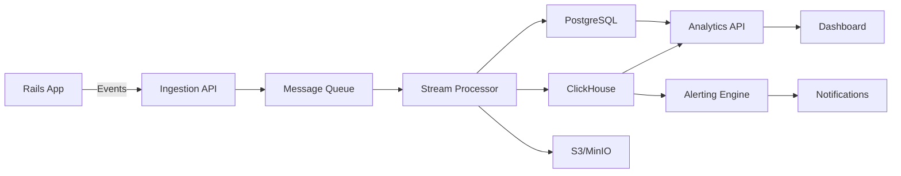

# ActiveSupervisor - Cloud SaaS or Self-Hosted AI Agent Monitoring

## Overview

ActiveSupervisor is a comprehensive monitoring and analytics platform for AI agents, deployable as either:
1. **Cloud SaaS** (activeagents.ai) - Managed service with zero infrastructure
2. **Self-Hosted** - Complete data ownership and privacy control

Think of it as "PostHog for AI Agents" - providing deep insights into agent behavior, performance, costs, and user interactions.

## Deployment Options

### Cloud SaaS (activeagents.ai)

```ruby
# Gemfile
gem 'active_supervisor_client'

# config/initializers/active_supervisor.rb
ActiveSupervisor.configure do |config|
  config.mode = :cloud
  config.api_key = Rails.credentials.active_supervisor_api_key
  config.endpoint = "https://api.activeagents.ai"
end
```

**Benefits:**
- Zero infrastructure management
- Automatic updates and scaling
- Global CDN for dashboard
- Managed data retention
- Team collaboration features
- Enterprise SSO/SAML

### Self-Hosted

```bash
# Docker Compose deployment
curl -L https://activeagents.ai/docker-compose.yml -o docker-compose.yml
docker-compose up -d

# Kubernetes deployment
helm repo add activesupervisor https://charts.activeagents.ai
helm install activesupervisor activesupervisor/activesupervisor \
  --set ingress.enabled=true \
  --set ingress.host=monitoring.yourcompany.com
```

**Benefits:**
- Complete data ownership
- Air-gapped deployment support
- Custom retention policies
- GDPR/HIPAA compliance
- No external dependencies
- Unlimited usage

## Architecture

### Core Components

```
┌─────────────────────────────────────────────────────────┐
│                   ActiveSupervisor                       │
├─────────────────────────────────────────────────────────┤
│                                                          │
│  ┌──────────────┐  ┌──────────────┐  ┌──────────────┐ │
│  │   Ingestion  │  │   Analytics  │  │   Dashboard  │ │
│  │     API      │  │    Engine    │  │      UI      │ │
│  └──────────────┘  └──────────────┘  └──────────────┘ │
│                                                          │
│  ┌──────────────┐  ┌──────────────┐  ┌──────────────┐ │
│  │  TimeSeries  │  │   Vector     │  │   Object     │ │
│  │   Database   │  │   Database   │  │   Storage    │ │
│  └──────────────┘  └──────────────┘  └──────────────┘ │
│                                                          │
│  ┌──────────────┐  ┌──────────────┐  ┌──────────────┐ │
│  │   Alerting   │  │   Export     │  │   Plugins    │ │
│  │    Engine    │  │     API      │  │   System     │ │
│  └──────────────┘  └──────────────┘  └──────────────┘ │
└─────────────────────────────────────────────────────────┘
```

### Technology Stack

#### Backend
- **API Framework**: Rails API or Go (for performance)
- **Time-Series DB**: ClickHouse or TimescaleDB
- **Vector DB**: Pgvector or Qdrant
- **Queue**: Redis or RabbitMQ
- **Object Storage**: S3-compatible (MinIO for self-hosted)

#### Frontend
- **Dashboard**: React/Next.js with Tremor or Recharts
- **Real-time**: WebSockets or Server-Sent Events
- **Mobile**: React Native companion app

#### Infrastructure (Self-Hosted)
- **Container**: Docker & Docker Compose
- **Orchestration**: Kubernetes (optional)
- **Reverse Proxy**: Caddy (automatic HTTPS)
- **Monitoring**: Prometheus + Grafana

## Features

### 1. Real-Time Monitoring

```ruby
# Your agent code remains unchanged
class ResearchAgent < ApplicationAgent
  include SolidAgent::Persistable  # Automatic tracking
  
  def analyze_topic
    prompt  # Automatically sent to ActiveSupervisor
  end
end
```

**Dashboard Shows:**
- Live agent activity
- Current prompt-generation cycles
- Active tool executions
- Real-time token usage
- Cost accumulation

### 2. Analytics & Insights

#### Agent Performance
- Response time percentiles (p50, p95, p99)
- Token usage patterns
- Cost per agent/action
- Error rates and types
- Success/failure ratios

#### User Analytics
- User engagement metrics
- Session analysis
- Conversation patterns
- User satisfaction scores
- Retention metrics

#### Business Metrics
- Cost optimization opportunities
- ROI per agent
- Usage trends
- Capacity planning
- Budget alerts

### 3. Prompt Engineering Hub

```sql
-- Automatic prompt performance tracking
SELECT 
  prompt_version,
  AVG(user_satisfaction) as avg_satisfaction,
  AVG(completion_tokens) as avg_tokens,
  AVG(latency_ms) as avg_latency,
  COUNT(*) as usage_count
FROM prompt_generations
GROUP BY prompt_version
ORDER BY avg_satisfaction DESC;
```

**Features:**
- A/B testing results
- Version performance comparison
- Regression detection
- Prompt optimization suggestions
- Template library

### 4. Anomaly Detection

```python
# ML-powered anomaly detection
def detect_anomalies(metrics):
    # Detect unusual patterns
    - Sudden cost spikes
    - Performance degradation
    - Error rate increases
    - Unusual user behavior
    - Security threats
```

### 5. Advanced Search & Filtering

```ruby
# Search across all agent interactions
ActiveSupervisor.search(
  query: "password reset",
  filters: {
    agent: "SupportAgent",
    date_range: 7.days.ago..Time.current,
    user_satisfaction: 1..3,
    has_errors: true
  },
  include_context: true
)
```

### 6. Compliance & Auditing

- Complete audit trail
- PII detection and masking
- GDPR data export/deletion
- SOC2 compliance reports
- Custom retention policies

## Client Libraries

### Ruby Client (for Rails apps)

```ruby
# Automatic integration with SolidAgent
class ApplicationAgent < ActiveAgent::Base
  include SolidAgent::Persistable
  include ActiveSupervisor::Trackable  # Adds monitoring
end
```

### JavaScript/TypeScript Client

```typescript
import { ActiveSupervisor } from '@activesupervisor/js';

const supervisor = new ActiveSupervisor({
  apiKey: process.env.ACTIVE_SUPERVISOR_KEY,
  endpoint: 'https://api.activeagents.ai' // or self-hosted URL
});

// Track custom events
supervisor.track('agent_interaction', {
  agent: 'ChatBot',
  userId: user.id,
  satisfaction: 5
});
```

### Python Client

```python
from activesupervisor import ActiveSupervisor

supervisor = ActiveSupervisor(
    api_key="your-api-key",
    self_hosted_url="https://monitoring.yourcompany.com"  # Optional
)

# Automatic tracking decorator
@supervisor.track_agent
def process_with_ai(prompt):
    response = agent.generate(prompt)
    return response
```

## Self-Hosting Guide

### Minimum Requirements

**Small (< 100k events/day)**
- 2 vCPUs, 4GB RAM
- 100GB SSD storage
- PostgreSQL or SQLite

**Medium (< 1M events/day)**
- 4 vCPUs, 16GB RAM
- 500GB SSD storage
- PostgreSQL + Redis

**Large (> 1M events/day)**
- 8+ vCPUs, 32GB+ RAM
- 1TB+ SSD storage
- ClickHouse + Redis + S3

### Quick Start

```bash
# 1. Clone the repository
git clone https://github.com/activeagent/activesupervisor
cd activesupervisor

# 2. Configure environment
cp .env.example .env
# Edit .env with your settings

# 3. Start with Docker Compose
docker-compose up -d

# 4. Run migrations
docker-compose exec web rails db:migrate

# 5. Create admin user
docker-compose exec web rails c
> User.create!(email: "admin@company.com", password: "secure_password", admin: true)

# 6. Access dashboard
open http://localhost:3000
```

### Production Deployment

```yaml
# kubernetes/activesupervisor.yaml
apiVersion: apps/v1
kind: Deployment
metadata:
  name: activesupervisor
spec:
  replicas: 3
  selector:
    matchLabels:
      app: activesupervisor
  template:
    metadata:
      labels:
        app: activesupervisor
    spec:
      containers:
      - name: web
        image: activesupervisor/activesupervisor:latest
        env:
        - name: DATABASE_URL
          valueFrom:
            secretKeyRef:
              name: activesupervisor-secrets
              key: database-url
        - name: REDIS_URL
          valueFrom:
            secretKeyRef:
              name: activesupervisor-secrets
              key: redis-url
        ports:
        - containerPort: 3000
---
apiVersion: v1
kind: Service
metadata:
  name: activesupervisor
spec:
  selector:
    app: activesupervisor
  ports:
  - port: 80
    targetPort: 3000
```

### Data Pipeline



## Pricing Model

### Cloud SaaS

**Free Tier**
- Up to 10k events/month
- 1 team member
- 7-day retention
- Community support

**Startup** ($99/month)
- Up to 1M events/month
- 5 team members
- 30-day retention
- Email support

**Business** ($499/month)
- Up to 10M events/month
- Unlimited team members
- 90-day retention
- Priority support
- SSO

**Enterprise** (Custom)
- Unlimited events
- Custom retention
- SLA guarantee
- Dedicated support
- On-premise option

### Self-Hosted

**Community Edition** (Free)
- Full feature set
- Unlimited usage
- Community support
- Apache 2.0 license

**Enterprise Edition** (Paid)
- Advanced security features
- LDAP/SAML integration
- Priority patches
- Professional support
- Custom plugins

## Comparison with Alternatives

| Feature | ActiveSupervisor | DataDog | New Relic | Custom Build |
|---------|-----------------|---------|-----------|--------------|
| AI-Native | ✅ | ❌ | ❌ | ❓ |
| Self-Hosted Option | ✅ | ❌ | ❌ | ✅ |
| Prompt Version Tracking | ✅ | ❌ | ❌ | ❓ |
| Token/Cost Tracking | ✅ | ❌ | ❌ | ❓ |
| Vector Search | ✅ | ❌ | ❌ | ❓ |
| Open Source Option | ✅ | ❌ | ❌ | ✅ |
| Zero-Config Integration | ✅ | ❌ | ❌ | ❌ |

## Security & Compliance

### Data Security
- End-to-end encryption
- At-rest encryption
- TLS 1.3 for transit
- API key rotation
- IP allowlisting

### Compliance
- GDPR compliant
- CCPA compliant
- SOC 2 Type II
- HIPAA ready (Enterprise)
- ISO 27001

### Privacy Features
- PII auto-detection
- Data masking
- User consent tracking
- Right to deletion
- Data portability

## Integrations

### Alerting
- Slack
- PagerDuty
- Opsgenie
- Email
- Webhooks
- SMS (Twilio)

### Data Export
- Snowflake
- BigQuery
- Redshift
- S3
- Elasticsearch
- Datadog

### Development
- GitHub
- GitLab
- Jira
- Linear
- VS Code Extension
- JetBrains Plugin

## Roadmap

### Q1 2025
- [ ] Public beta launch
- [ ] Self-hosted installer
- [ ] Basic alerting
- [ ] Slack integration

### Q2 2025
- [ ] ML-powered insights
- [ ] Advanced anomaly detection
- [ ] Mobile app
- [ ] Plugin marketplace

### Q3 2025
- [ ] Enterprise features
- [ ] Multi-region support
- [ ] Advanced compliance
- [ ] White-label option

### Q4 2025
- [ ] AI assistant for debugging
- [ ] Predictive analytics
- [ ] Cost optimization AI
- [ ] Automated remediation

## Open Source Strategy

**Core (MIT License)**
- Full monitoring platform
- All basic features
- Community plugins
- Docker deployment

**Enterprise (Commercial)**
- Advanced security
- Priority support
- Custom integrations
- SLA guarantees

## Getting Started

### For Cloud Users

1. Sign up at [activeagents.ai](https://activeagents.ai)
2. Get your API key
3. Add to your Rails app:
   ```ruby
   gem 'active_supervisor_client'
   ```
4. Configure and deploy
5. View dashboard at app.activeagents.ai

### For Self-Hosted Users

1. Deploy with Docker/Kubernetes
2. Configure your Rails app to point to your instance
3. Start monitoring
4. Customize as needed

## Support

- **Documentation**: docs.activeagents.ai
- **Community**: discord.gg/activeagents
- **GitHub**: github.com/activeagent/activesupervisor
- **Email**: support@activeagents.ai
- **Enterprise**: enterprise@activeagents.ai