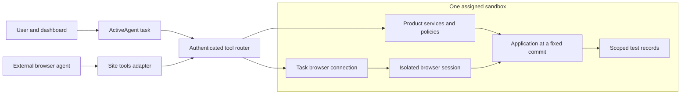

# Native product tools and sandbox sessions

Date: 2026-09-09. Branch: `codex/dashboard-evidence-assistant`.
Decision: build the interaction layer in ActiveAgents, without a Tidewave runtime
dependency. Status: architecture specified; this extension is not implemented.
This plan accompanies the implementation PR recorded in [PR.md](PR.md).
No separate branch, remote issue, or infrastructure resource was created for it.

## Site tools and execution

Site tools expose named actions from a live page to a compatible browser agent.
WebMCP is the proposed browser interface. OpenAI's implementation supports
JavaScript registration in the top-level page using its signed-in session.
Server MCP exposes tools independently of an open page. Neither provisions a
sandbox by itself. [Official site-tools documentation](https://learn.chatgpt.com/docs/webmcp).

ActiveAgents should own the capability definitions and execution policy. Its
dashboard agent, a WebMCP adapter for external browser agents, and its evaluation
runner should use the same product operations. The dashboard agent needs its own
browser request/reply connection; browser WebMCP support does not automatically
let a server-side ActiveAgent invoke JavaScript in a user's tab.

The adapter can also operate an authorized local development app. Repository
evaluation assigns a real Incus/COI workspace and records its identity. Browser
sessions, application data and tool outputs stay with that task and organization.
Execution credentials and endpoint addresses come from the control plane, not
model arguments or repository-provided URLs.

## Reusable contract

1. A host tool resolver receives the authenticated actor, owning organization,
   task and assigned sandbox, captured on the server. Organization alone cannot
   enforce different member roles.
2. Register explicit schemas and handlers. Validate argument types and limits,
   reject unknown names, and authorize every invocation through the host's policy
   scopes and services. A catalog entry is not executable authority.
3. Return bounded model data and separately validated UI actions: open an allowed
   view, populate a draft, show run progress, or display a proposed change.
   Model prose never becomes JavaScript or an arbitrary navigation URL.
4. Bind the browser connection to a short-lived task identity, request IDs,
   expiry, cancellation and state revision. Recheck targets after navigation;
   reject replies from another tab, user, organization or task.
5. Persist evidence under the same owner. Side effects need idempotency and a
   verified result. Respect authorization already granted for the task; ask for
   more approval only when an action exceeds it or the product requires it.

Client adapters and business rules stay in their private repositories. Only the
generic protocol, engine behavior and synthetic examples belong here.

## First workflow

Use the engine's existing agent and evaluation operations:

| Operation | Observable result |
|---|---|
| Read current view | Allowed context, selected agent/run, available actions |
| Prepare or edit an agent draft | Builder reflects instructions, model and tools |
| Save an authorized draft | Persisted agent/version ID and refreshed builder |
| Start a selected evaluation | Real queued run ID, bounded scope and budget |
| Read evaluation progress | Scenario results and explicit terminal state |
| Open a result | Exact report appears while the assistant remains available |

A developer can ask to apply instructions to a draft, evaluate the selected suite,
and open failures. The assistant performs those actions and reports recorded
results. Receiving a run ID means queued, not passed. Provider setup errors remain
distinct from incorrect answers.

## Issues and acceptance milestones

- M1.5a: request-bound registry; actor plus owner; schema validation; per-call
  authorization; synthetic cross-owner tests.
- M1.5b: persistent assistant panel and authenticated browser connection; real UI
  updates; reconnection, cancellation and stale-state tests. WebMCP is an optional
  adapter over the same handlers.
- M1.5c: authorized builder save and asynchronous evaluation tools; per-scenario
  budgets; verifiable results; browser/API tests of the same capability contract.
- M3 extension: provision the branch app and isolated browser in the registered
  Incus/COI backend; bind owner/task/commit; record M2's manifest. Run a real tool
  workflow before claiming sandbox support.

Current gaps: the assistant has four fixed evidence/draft tools, no browser
request/reply connection, and no host-tool registry. The existing
`PlaywrightMCPClient.instance` shares a process-wide session and cannot serve this
isolation boundary. The engine's built-in sandbox backend is a mock; a backend
label does not establish real execution. These gaps require implementation.

Reviewed the assistant, framework tool callbacks, owner hooks, MCP conversion,
browser client and sandbox registry. No product permissions or tool executions
were enabled. Earlier M1 checks in [RESULTS.md](RESULTS.md) do not validate this
proposed extension.
