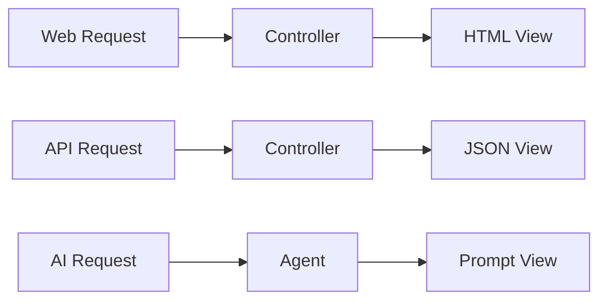

# AI on Rails with Active Agent

### Making Rails the Best Framework for AI-Powered Apps

<div class="pt-12">
  <span @click="$slidev.nav.next" class="px-2 py-1 rounded cursor-pointer" hover="bg-white bg-opacity-10">
    Rails World 2025 • Amsterdam <carbon:arrow-right class="inline"/>
  </span>
</div>

<div class="abs-br m-6 flex gap-2">
  <a href="https://github.com/activeagent/activeagent" target="_blank" alt="GitHub" title="Open in GitHub"
    class="text-xl slidev-icon-btn opacity-50 !border-none !hover:text-white">
    <carbon-logo-github />
  </a>
</div>

<!--
Pause after title
Make eye contact with audience
"Rails changed web development 20 years ago. Today, let's talk about how it's perfectly positioned for the AI revolution."
-->

---
transition: fade-out
layout: statement
---

# Rails is the Best Framework for Building AI Apps

<v-click>

*Yes, better than Python frameworks*

</v-click>

<v-click>

*Yes, better than Node.js*

</v-click>

<v-click>

*Yes, I'm serious*

</v-click>

<!--
Let this sink in
"I know this sounds controversial in a world dominated by Python AI libraries..."
"But hear me out - Rails has something unique to offer"
-->

---
transition: slide-up
---

# Why Rails? Because We've Solved the Hard Parts

<div class="grid grid-cols-2 gap-4 pt-4">

<div>

### What Rails Provides

<v-clicks>

- **Convention over Configuration**
- **ActiveRecord** for data persistence
- **ActionCable** for real-time streaming
- **ActiveJob** for background processing
- **Mature ecosystem**

</v-clicks>

</div>

<div>

### For AI, This Means

<v-clicks>

- Less AI boilerplate
- Natural conversation storage
- Streaming responses built-in
- Long-running generations
- Auth, deployment, monitoring solved

</v-clicks>

</div>

</div>

<!--
"While others are building auth systems, we're building AI features"
"Rails conventions eliminate 80% of the AI integration complexity"
-->

---
transition: slide-left
---

# Current AI Development is a Mess

```python {all|2|3|4|5|6|7}
# Every Python AI app reinvents these wheels:
- Session management
- User authentication  
- Background processing
- WebSocket handling
- Database migrations
- API versioning
```

<div v-click class="mt-8 text-2xl font-bold text-center">
We spend more time on plumbing than AI
</div>

<!--
"Look familiar? This is every FastAPI + LangChain project"
"We're solving solved problems"
-->

---
transition: fade
layout: center
---

# Active Agent
## AI Agents as Rails Controllers

```ruby {all|2|3-5|all}
class SupportAgent < ApplicationAgent
  def answer_question
    @question = params[:question]
    prompt  # It's just a Rails view!
  end
end
```

<div v-click class="mt-8 text-xl">
Agents inherit from controllers. It's that simple.
</div>

<!--
"What if AI agents were just... controllers?"
"What if prompts were just... views?"
"This is Active Agent"
-->

---
transition: slide-up
---

# Reduce Complexity Through Convention

<div class="grid grid-cols-2 gap-8">

<div>

### Without Active Agent

<v-clicks>

- Configure prompt templates
- Set up message threading
- Wire up tool definitions
- Handle streaming responses
- Manage context windows

</v-clicks>

</div>

<div>

### With Active Agent

```bash
rails generate active_agent:agent Support answer_question
```

<v-click>

✅ Views created  
✅ Tools configured  
✅ Tests scaffolded  
✅ Ready to use  

</v-click>

</div>

</div>

<!--
"One command. Full agent scaffold."
"Views, tools, tests - all created with Rails conventions"
-->

---
transition: slide-left
layout: two-cols
---

# Prompts are Just Action Views

::left::

```erb
<%# app/views/support_agent/answer_question.text.erb %>
Customer Question: <%= @question %>

<% if @ticket.present? %>
Ticket #<%= @ticket.id %>
Priority: <%= @ticket.priority %>
<% end %>

Please provide a helpful response.
```

::right::

<div class="pl-4">

### Use Rails View Powers

<v-clicks>

- ERB templates
- Partials for reusability  
- Helpers for formatting
- Layouts for structure
- Content negotiation

</v-clicks>

</div>

<!--
"Your prompt templates use ERB, just like your HTML views"
"Partials for reusable prompt components"
"Helpers for formatting"
"This is the Rails way"
-->

---
transition: fade
---

# System Instructions are Views Too

```erb {all|2|4-5|7-10}
<%# app/views/support_agent/instructions.text.erb %>
You are a support agent for <%= Rails.application.name %>.

Current user: <%= current_user.name %>
Time: <%= Time.current %>

Guidelines:
- Be helpful and friendly
- Use available tools when needed
- Respect user privacy
```

<div v-click class="mt-8">

Dynamic • Contextual • Testable

</div>

<!--
"System prompts get the same treatment"
"Dynamic, contextual, testable"
-->

---
transition: slide-left
---

# Messages Follow Rails Patterns

```ruby {all|1-4|5|7-8|all}
generation = SupportAgent.with(
  question: "How do I reset my password?",
  user_id: current_user.id
).answer_question
response = generation.generate_now

response.message.content      # The AI's response
response.requested_actions    # Tools the AI wants to use
```

<div class="mt-8 grid grid-cols-3 gap-4 text-center">

<div v-click>
<carbon-data-1 class="text-3xl mb-2 inline"/>
<div>Parameters like Rails params</div>
</div>

<div v-click>
<carbon-send-alt class="text-3xl mb-2 inline"/>
<div>Request/Response pattern</div>
</div>

<div v-click>
<carbon-tools class="text-3xl mb-2 inline"/>
<div>Familiar Rails objects</div>
</div>

</div>

<!--
"Parameters work like Rails params"
"Responses are objects you can work with"
"It feels like Rails because it IS Rails"
-->

---
transition: slide-up
---

# Public Methods Become AI Tools

```ruby {all|2-5|7-13|all}
class SupportAgent < ApplicationAgent
  def search_knowledge_base(query:)
    # This becomes a tool the AI can call!
    Article.search(query).limit(5)
  end
  
  def create_ticket(title:, priority:)
    # Another tool, automatically available
    Ticket.create!(
      title: title,
      priority: priority,
      user: current_user
    )
  end
end
```

<div v-click class="mt-6 text-center text-xl">
No manual tool registration. Just write Ruby methods.
</div>

<!--
"Every public method becomes a tool"
"The AI knows how to use them from your JSON views"
"No manual tool registration needed"
-->

---
transition: fade
layout: center
class: text-center
---

# Model Context Protocol 📡
## The Future of AI Tool Integration

<div class="grid grid-cols-3 gap-4 mt-8">

<div v-click>
<carbon-standard-carbon class="text-4xl mb-2 inline"/>
<div class="font-bold">Industry Standard</div>
<div class="text-sm">For tool communication</div>
</div>

<div v-click>
<carbon-plug class="text-4xl mb-2 inline"/>
<div class="font-bold">Provider Agnostic</div>
<div class="text-sm">Works with any AI model</div>
</div>

<div v-click>
<carbon-checkmark-filled class="text-4xl mb-2 inline"/>
<div class="font-bold">Rails-Ready</div>
<div class="text-sm">Active Agent supports MCP</div>
</div>

</div>

<div v-click class="mt-8">

```ruby
class ResearchAgent < ApplicationAgent
  def analyze
    prompt(mcp_servers: ["postgresql", "github", "slack"])
  end
end
```

</div>

<!--
"MCP is like OAuth for AI tools"
"Developed by Anthropic, adopted industry-wide"
"Your Rails app can talk to any MCP server"
"Database queries, API calls, file systems - all standardized"
-->

---
transition: slide-left
---

# Vector Search with Rails Conventions

```ruby {all|1-2|4-7|10-11}
class Article < ApplicationRecord
  has_neighbors :embedding
  
  def self.semantically_similar(text)
    embedding = generate_embedding(text)
    nearest_neighbors(:embedding, embedding, distance: "cosine")
  end
end

# In your agent:
similar_articles = Article.semantically_similar(@question)
```

<div class="mt-8 text-center">

<v-clicks>

✨ Neighbor gem brings vector search to ActiveRecord  
🔗 It's just another Rails association  
🐘 pgvector under the hood  

</v-clicks>

</div>

<!--
"Neighbor gem brings vector search to ActiveRecord"
"It's just another Rails association"
"pgvector under the hood"
-->

---
transition: slide-up
layout: image-right
image: /rails-stack.png
---

# Standing on the Shoulders of Giants

<v-clicks>

- **AbstractController** → Request handling
- **ActionView** → Template rendering  
- **ActiveJob** → Background generation
- **ActionCable** → Streaming responses
- **ActiveRecord** → Conversation persistence

</v-clicks>

<div v-click class="mt-4">

```ruby
class ChatAgent < ApplicationAgent
  def chat
    prompt stream: true  # Built-in!
  end
end
```

</div>

<!--
"We're not reinventing Rails, we're extending it"
"Every Rails feature is available to your agents"
"Callbacks, filters, concerns - it all works"
-->

---
transition: fade
---

# Rails Gets Even Better

<div class="grid grid-cols-2 gap-8">

<div>

### Separation of Concerns

```
Models      → Business logic
Controllers → Web endpoints  
Agents      → AI interactions ✨
Views       → UI (human or AI)
```

</div>

<div>

### One App, Multiple Interfaces



</div>

</div>

<div v-click class="mt-8 text-center text-xl">
Same conventions, same patterns, same deployment
</div>

<!--
"Agents are a new layer in the Rails stack"
"Same conventions, same patterns"
"Your team already knows how to use this"
-->

---
transition: slide-left
---

# In Production Today

```ruby {all|2|4-6|8-11|all}
class ContentModerationAgent < ApplicationAgent
  before_action :load_content
  
  def moderate
    prompt output_schema: :moderation_result
  end
  
  def escalate_to_human(reason:)
    @content.flag_for_review!(reason)
    AdminMailer.content_flagged(@content).deliver_later
  end
end
```

<div class="mt-8 text-center">

<div class="text-3xl font-bold">
Processing 10K+ pieces of content daily
</div>

<div v-click class="mt-4 text-lg">
Same deployment • Same monitoring • Same workflow
</div>

</div>

<!--
"This isn't theory - it's running in production"
"Same deployment as your Rails app"
"Same monitoring, same logs, same workflow"
-->

---
transition: fade-out
layout: center
---

# Start Building AI on Rails

```bash {all|1|2|3}
gem 'activeagent'
rails generate active_agent:install
rails generate active_agent:agent Assistant chat search
```

<div class="mt-12 text-2xl">

[activeagent.ai](https://activeagent.ai)

[github.com/activeagent/activeagent](https://github.com/activeagent/activeagent)

</div>

<div v-click class="mt-8 text-3xl font-bold">
Rails is ready for AI. Are you?
</div>

<!--
"Three commands to AI-powered Rails"
"Documentation, examples, and community at activeagent.ai"
[PAUSE]
"Let's build the future of AI... on Rails"
-->

---
layout: end
class: text-center
---

# Thank You! 🚂 + 🤖

<div class="mt-8">

### Questions? Find me at:

**Hallway track**

**@[your_handle]**

**activeagent.ai/community**

</div>

<!--
"Thank you Rails World!"
[Wait for applause]
[Exit stage]
-->

---
layout: section
---

# Backup Slides

For Q&A or if we have extra time

---

# Works with All Major Providers

<div class="grid grid-cols-3 gap-4">

<div>

### Cloud Providers
- OpenAI (GPT-4)
- Anthropic (Claude)
- Google (Gemini)
- OpenRouter (100+ models)

</div>

<div>

### Local Models
- Ollama
- LM Studio
- llama.cpp

</div>

<div>

### Configuration

```yaml
# config/active_agent.yml
production:
  openai:
    model: gpt-4
  anthropic:
    model: claude-3-opus
```

</div>

</div>

---

# Test Like Any Rails Component

```ruby
class SupportAgentTest < ActiveSupport::TestCase
  test "answers questions accurately" do
    VCR.use_cassette("support_answer") do
      response = SupportAgent.with(
        question: "How do I reset my password?"
      ).answer_question.generate_now
      
      assert response.message.content.include?("password")
      assert response.requested_actions.none?
    end
  end
end
```

---

# Performance Metrics

<div class="grid grid-cols-2 gap-8 mt-8">

<div>

### Response Times
- First token: < 500ms
- Complete response: < 2s
- Tool execution: < 100ms

</div>

<div>

### Resource Usage
- Memory: Same as Rails controller
- CPU: Minimal (API-based)
- Scaling: Horizontal with Rails

</div>

</div>

---
layout: center
---

# Questions?

### Common Questions We Anticipate:

1. How does this compare to LangChain?
2. What about Python's ML ecosystem?
3. Does this work with Rails 7.x?
4. How do you handle rate limiting?
5. What's the performance overhead?

---
layout: center
class: text-center
---

# Let's Build the Future of AI

## On Rails

<div class="mt-8">
<carbon-logo-github class="text-4xl inline mx-2"/>
<carbon-logo-twitter class="text-4xl inline mx-2"/>
<carbon-email class="text-4xl inline mx-2"/>
</div>